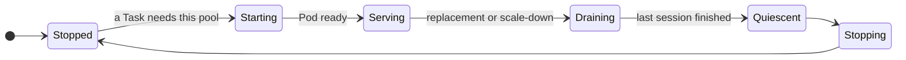
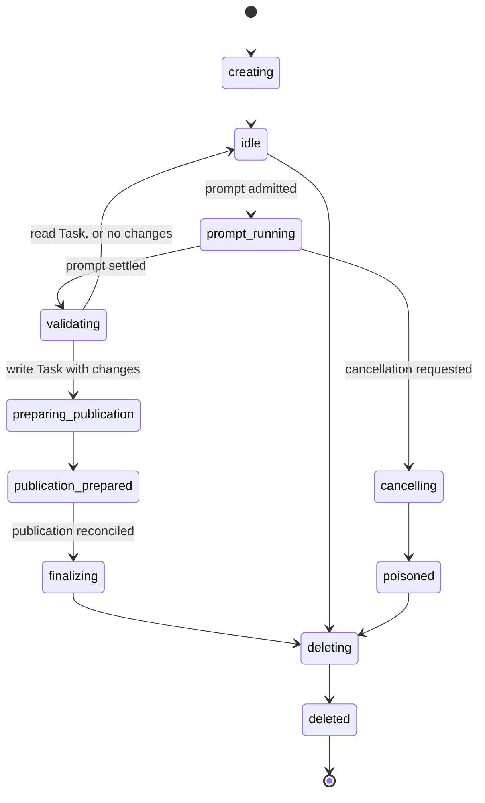
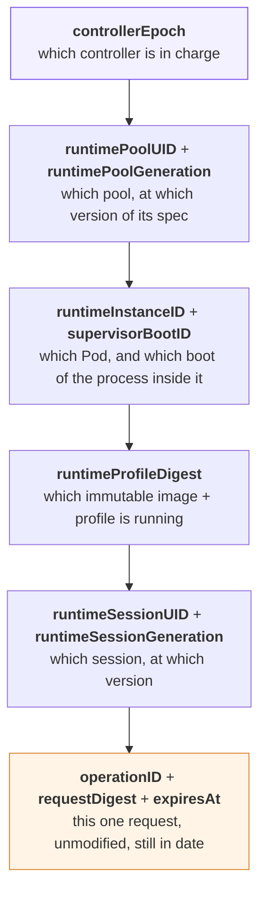

# Agent runtimes

`type: agent` Tasks use the ACP core runtime and the `orka.harness.v2` session protocol. Built-in Codex, Claude, Copilot, and OpenCode profiles run in controller-owned `RuntimePool` resources; there is no per-Task agent Job and no fallback runtime path.

Orka owns the durable Task attempt, RuntimeSession identity, queueing, workspace validation, delivery receipt, transcript, and result projection. The runtime Pod owns only the short-lived provider process and ACP session for a fenced RuntimeSession.

The supported built-in set is intentionally closed: `codex`, `claude`,
`copilot`, and `opencode`. Operators can register and conformance-test an
external `orka.harness.v2` `AgentRuntime`, but Task dispatch through
`runtimeRef` remains fail-closed until the external v2 dispatcher support
boundary is enabled.

## Supported runtime profiles

| Runtime | `Agent.spec.runtime.type` | Packaging status |
| --- | --- | --- |
| Codex | `codex` | Immutable Codex ACP image definition is included. Configure a digest-pinned image. |
| Claude | `claude` | Immutable Claude ACP image definition is included. Configure a digest-pinned image. |
| Copilot | `copilot` | Immutable Copilot ACP image definition is included. Configure a digest-pinned image. |
| OpenCode | `opencode` | Immutable OpenCode ACP image definition is included. Configure a digest-pinned image. |

External runtimes use an `AgentRuntime` registration with `contractVersion: orka.harness.v2`. Current-generation conformance proves the exact instance, profile, cancellation, duplicate, and workspace-governance claims, but readiness does not yet enable `runtimeRef` Task dispatch. See [Bring your own AgentRuntime](../guides/bring-your-own-agent-runtime.md) and the [adapter contract](../development/agent-runtime-adapter-contract.md).

## Architecture

```text
Task (type: agent)
  -> durable ACP attempt and queue reservation
  -> central authenticated provider proxy -> Vekil/model backend
  -> controller-owned RuntimePool for one trust domain/profile
     -> one exact runtime Pod (0 or 1 replica)
        -> RuntimeSession A: private HOME/workspace/UID + provider process
        -> RuntimeSession B: private HOME/workspace/UID + provider process
        -> per-session loopback MCP proxy -> controller prompt broker
  -> workspace delta validation
  -> artifact + credential brokers -> separate Workspace/Publisher identity
  -> clean-room clone, prepare, push, verify, and optional PR reconciliation
  -> durable execution and delivery status projected onto the Task
```

A shared runtime Pod is a same-trust-domain density optimization, not a tenant isolation boundary. Different namespaces/profile digests are assigned different logical pools.

## RuntimePools

RuntimePools are controller-owned implementation resources. Do not hand-author them for normal built-in Tasks. The controller derives a pool from the Task namespace, runtime type, model, immutable adapter/image digests, tool and approval policy, workspace intent, proxy credential scope, and resource class.

The first-release defaults are:

- one active Pod per pool;
- up to 10 resident RuntimeSessions;
- up to 4 concurrently running prompts;
- scale from zero on durable demand;
- admit new sessions only while lifecycle is `Serving` and admission is `Accepting`;
- drain to `Quiescent` before scale-down or replacement.

Pool lifecycle is:



`Serving` is the only lifecycle that admits a new RuntimeSession, and only while
`status.admissionState` is also `Accepting`. Two more lifecycles are not shown above because the
controller can enter them from anywhere: **`Degraded`** (something is wrong — rollout failed,
scheduling failed, quota denied) and **`Ambiguous`** (the controller cannot prove what the pool is
doing). Both close admission, so new work waits instead of landing on a pool nobody can vouch for.

Capacity reservations live in `RuntimePool.status` and use Kubernetes
`resourceVersion` compare-and-swap. The dispatcher claims a resident/prompt slot
before changing an attempt to `Reserved`, renews or converts it as work moves
through the session lifecycle, and reclaims expired reservations after restart.

Inspect pools with:

```bash
orka runtime-pool list
orka runtime-pool get '<pool-name>' -o yaml
kubectl get runtimepools
```

## ACP v2 Task lifecycle

The durable Task execution state is independent from the top-level compatibility phase. It is
drawn in full under [Task lifecycle](architecture.md#task-lifecycle). Two states are worth calling
out here:

- `SubmittedUnknown` records a loss in the submit acknowledgement window — Orka sent the prompt and
  never learned whether the runtime received it.
- `OutcomeUnknown` is terminal for that attempt. Do not treat it as a generic retryable failure;
  the whole point is that a retry might run your prompt a second time.

For built-in runtimes, the RuntimeSession lifecycle is:



Reading it:

- **Only an `idle` session can accept a prompt or be evicted.** Everything else is busy holding
  state that must not be interrupted.
- The session freezes the validated workspace delta and waits in `publication_prepared`.
  The controller and clean-room Publisher prepare the commit, push, and verify the remote,
  recording progress in a `Publication`. The controller then asks the supervisor to finalize
  the session using the terminal publication receipt.
- **`poisoned`** is the escape hatch for uncertainty. A session that cannot prove it cleaned up its
  processes, that its workspace is intact, or that publication was safe is poisoned and deleted
  rather than reused. The pool may be recycled with it. Any state above can reach `poisoned`; the
  arrows are omitted so the main flow stays readable.
- Validation, publication, finalization, and the release of the Session lease all complete before
  the Task shows a terminal status. A `Succeeded` Task means the work is done and verified, not
  merely started.

## Durable control authority

ACP control decisions are Kubernetes-authoritative:

- `ControllerEpoch`, `PromptAttempt`, `RuntimeSessionControl`, `BranchClaim`,
  `Publication`, and `ExternalEffect` status transitions use
  `resourceVersion` compare-and-swap;
- coordination Leases serialize controller-epoch mutation and one logical
  Session mutation at a time;
- `RuntimePool.status` owns exact-instance lifecycle, demand, capacity, and
  reservation state.

SQLite is not a second ACP control authority. It persists transcript and
SessionTurn payloads, deferred outbox projections, and artifacts
behind the Kubernetes fences. Cross-store finalization binds the exact outbox
projection before releasing the Session lease.

### What a fence is, and why every request carries one

A **fence** is a set of identifiers attached to every mutating request. The receiver compares
them against what it believes to be true and rejects anything that does not match exactly.

The problem it solves: a controller can be network-partitioned, lose leadership, come back, and
try to finish work it started — while a *new* controller is already doing that work. Without a
fence, the old controller's late request looks identical to a legitimate one. With a fence, its
stale controller epoch does not match and the request is refused.

The identifiers nest, from the widest scope to the narrowest:



| Field | Rejects | Because |
| --- | --- | --- |
| `controllerEpoch` | a controller that lost leadership | a new controller has taken over |
| `runtimePoolUID` / `runtimePoolGeneration` | a request for a deleted or reconfigured pool | the pool it was written for no longer exists in that shape |
| `runtimeInstanceID` / `supervisorBootID` | a request aimed at a Pod that has since restarted | the process that held the session state is gone |
| `runtimeProfileDigest` | a request assuming a different image or profile | the runtime is not the one the request was planned against |
| `runtimeSessionUID` / `runtimeSessionGeneration` | a request for a session that was recreated | the new session is not the old one, even under the same name |
| `operationID` | reuse of an operation ID with a different request digest | one operation ID identifies one immutable request |
| `requestDigest` | a request whose body was altered in transit | the digest covers the whole request |
| `expiresAt` | a request that sat in a queue too long | the world may have moved on |

Session-scoped fields are omitted for pool-wide operations such as drain, which have no session.

Identical retries with the same `operationID` and `requestDigest` replay the recorded response
without repeating the effect, provided the fences and expiry are still valid. These replays
return HTTP 200; reusing the operation ID with a different digest returns `digest_conflict`
with HTTP 409.

If an authenticated drain request or status probe fails during rollout or scale-down, the
controller marks the `RuntimePool` as `Degraded`, closes admission, and preserves the old Pod.
Later reconciles recheck the drain, and replacement or scale-down requires authenticated
quiescence. Prompt or publication outcomes that cannot be proven may put a Task in
`OutcomeUnknown`; see [Task lifecycle](architecture.md#task-lifecycle).

## Create an Agent

Provider credentials are separate from Git credentials. Built-in ACP Agents do
not set `secretRef`: the controller scopes each RuntimePool to the central
authenticated provider proxy, which injects the upstream Vekil/model credential
outside the ACP child process.

```yaml
apiVersion: core.orka.ai/v1alpha1
kind: Agent
metadata:
  name: codex-reviewer
spec:
  runtime:
    type: codex
    contractVersion: orka.harness.v2
    defaultMaxTurns: 20
    defaultAllowBash: true
    defaultAllowedTools:
      - Read
      - Glob
      - Grep
  model:
    name: gpt-5.4
```

OpenCode model IDs use provider/model form, for example `openai/gpt-5.4`.
OpenCode selects `apply_patch` for GPT-family models and `edit`/`write` for
others; Orka normalizes those aliases into one governed mutation capability, so
allowing one exposes the group and disallowing one closes the group. For
read-intent workspaces, Orka also disables Bash and OpenCode Grep because Grep
cannot carry the secret-file exclusions applied to OpenCode Read; Read and Glob
remain available when allowed by policy.

Task-level `spec.agentRuntime` contains only runtime overrides such as `maxTurns`, `allowedTools`, `disallowedTools`, and `allowBash`. Repository configuration belongs at top-level `spec.workspace`.

## Read-only workspace Task

Agent Tasks default to `intent: read` when `workspace.intent` is omitted, but setting it explicitly makes review intent clear.

```yaml
apiVersion: core.orka.ai/v1alpha1
kind: Task
metadata:
  name: review-repository
spec:
  type: agent
  agentRef:
    name: codex-reviewer
  prompt: Review the authentication package. Do not modify files.
  workspace:
    intent: read
    gitRepo: https://github.com/example/project.git
    ref: 0123456789abcdef0123456789abcdef01234567
    readCredentialRef:
      name: project-read
    subPath: services/auth
  agentRuntime:
    maxTurns: 20
    allowBash: true
  timeout: 20m
```

The clean-room workspace boundary resolves `project-read` for one clone/read operation, verifies the source baseline, removes credentials, and stores a sanitized workspace artifact. The runtime downloads that artifact without SCM credentials or direct SCM publication access.

A read Task succeeds only after validation proves the final tree still matches the verified baseline. Unexpected changes are classified `ReadOnlyWorkspaceModified` and poison the RuntimeSession.

## Write and publication Task

Source read, target read, target write, and forge API credentials are distinct
roles, even when an operator deliberately backs multiple roles with the same
Secret.

```yaml
apiVersion: core.orka.ai/v1alpha1
kind: Task
metadata:
  name: update-documentation
spec:
  type: agent
  agentRef:
    name: codex-reviewer
  prompt: Update the authentication documentation and run its focused checks.
  workspace:
    intent: write
    gitRepo: https://github.com/example/project.git
    branch: main
    readCredentialRef:
      name: project-read
    publicationGitRepo: https://github.com/example/project.git
    publicationReadCredentialRef:
      name: project-publication-read
    publicationCredentialRef:
      name: project-publish
    forgeCredentialRef:
      name: project-forge
    pushBranch: orka/update-auth-docs
    prBaseBranch: main
    createPR: true
  agentRuntime:
    maxTurns: 40
    allowBash: true
  timeout: 40m
```

The ACP child may edit the materialized checkout, but its Git configuration, refs, hooks, filters, remotes, and history are never trusted for publication. After prompt settlement, the supervisor freezes the session process tree and produces a bounded, content-addressed workspace delta. The separate Workspace/Publisher then:

1. creates a clean clone at the persisted baseline with the source-read credential;
2. applies the validated delta;
3. prepares a deterministic Orka-owned commit;
4. records the exact tree, commit, and artifact digests;
5. compare-and-swap publishes the exact commit with the target-write credential;
6. independently verifies the remote ref with the target-read credential;
7. reconciles a pull request with the forge-only credential when `createPR: true`.

At reservation, Orka freezes the selected Secret UID/resourceVersion and key for
each role. The credential broker releases a value only to the
Workspace/Publisher for the exact active operation. No Git or forge credential
enters the runtime Pod. Branch push is the minimum durable delivery;
pull-request reconciliation is opt-in.

Workspace deltas and prepared publication artifacts cross the controller API
through short-lived artifact capabilities bound to the operation, method,
path, digest, size, media type, identity, and expiry. The Publisher does not
hold the artifact signing key.

## Workspace fields

| Field | Purpose |
| --- | --- |
| `intent` | `read` or `write`; defaults to `read` for agent Tasks and is immutable for an active attempt. |
| `gitRepo` | Credential-free source repository URL. |
| `sourceRepository` | Optional canonical provider repository identity. |
| `branch` / `ref` | Source branch or exact ref/commit/tag. |
| `readCredentialRef.name` | Secret used only by the clean-room clone/read boundary. |
| `publicationGitRepo` | Credential-free repository URL that receives the publication branch. |
| `publicationRepository` | Optional canonical publication repository identity. |
| `publicationReadCredentialRef.name` | Target-read Secret used only for publication preflight and independent verification. |
| `publicationCredentialRef.name` | Target-write Secret used only for the exact compare-and-swap push. |
| `forgeCredentialRef.name` | Forge API Secret used only for pull-request reconciliation. Required when `createPR` is true. |
| `subPath` | Repository subdirectory exposed as the workspace root. |
| `pushBranch` | Publication branch. If omitted for a write Task, Orka derives a full-entropy Task- or Session-owned branch. |
| `prBaseBranch` | Pull-request base branch when `createPR` is true. |
| `createPR` | Explicitly request PR reconciliation after verified branch publication. |

Do not embed credentials, query strings, or fragments in repository URLs.

## Delivery status

`status.delivery` is the authoritative non-secret receipt. Intermediate states include `Validating`, `Preparing`, `Prepared`, `Publishing`, and `Verifying`. Terminal outcomes include:

- `ReadValidated` — read-only tree matches the verified baseline;
- `NoChange` — a write Task produced no validated change;
- `VerifiedExact` — the remote branch equals the prepared commit;
- `DeliveredSuperseded` — the prepared commit is present and a verified descendant now leads the branch;
- `ReadOnlyWorkspaceModified` — a read Task changed the workspace;
- `CredentialBlocked` — a required credential could not be resolved or used;
- `DeliveryConflict` — branch ownership or exact-ref reconciliation failed;
- `PublicationOutcomeUnknown` — the remote could not be observed after bounded reconciliation;
- `CancelledBeforePublish` — cancellation won before publication.

Use `orka task status <name>` or inspect the Task YAML to see execution, RuntimePool, and delivery data.

## Session continuity

Use `spec.sessionRef` for canonical transcript continuity and serialized mutation of one logical session:

```yaml
spec:
  sessionRef:
    name: repository-review-session
  workspace:
    intent: read
    gitRepo: https://github.com/example/project.git
```

A RuntimeSession is ephemeral. If its Pod is replaced, Orka may create a fresh provider session from the verified workspace baseline and canonical transcript. ACP v2 intentionally does not provide prompt replay, stream reconnect, provider-session load, or workspace checkpoint endpoints.

## Runtime and credential boundaries

Built-in runtime Pods:

- use a digest-pinned image and immutable runtime-profile digest;
- have no Git read or publication credential;
- have no direct SCM egress;
- use a read-only root filesystem and no service-account token;
- isolate resident sessions with private directories, distinct non-reused UIDs/GIDs, and process-tree cleanup;
- expose only non-sensitive health/capability probes without authentication;
- require controller authentication and operation-scoped authorization for status and mutations.

Provider traffic goes only to the central authenticated provider proxy. The
proxy accepts the controller-issued RuntimePool bearer, enforces the configured
provider/model path, and forwards to Vekil. The `config/acp-production` overlay
also applies the Vekil ingress policy so runtime Pods cannot bypass that proxy.

Each RuntimeSession receives a credential-protected loopback MCP endpoint. It
lists the canonical prompt tool policy while idle, but executes calls only for
the active Task/attempt/prompt/lease. The controller broker revalidates the
exact runtime fences, tool allowlist, approval evidence, and lease expiry on
every call. Consequential calls reserve an `ExternalEffect` identity before
execution and replay only a committed matching response.

The Workspace/Publisher has brokered SCM/forge credentials and artifact access,
but no provider or prompt-scoped MCP access.

## Controller configuration

ACP is active when the controller runs in `harness-v2` mode; there is no
separate ACP enablement flag. At minimum, set the controller mode and configure
immutable images:

```text
--controller-mode=harness-v2
--acp-runtime-namespace=orka-runtimes
--acp-provider-proxy-namespace=orka-system
--acp-provider-proxy-base-url=http://provider-auth-proxy.orka-system.svc:8080
--acp-codex-runtime-image=<repository>@sha256:<digest>
--acp-claude-runtime-image=<repository>@sha256:<digest>
--acp-copilot-runtime-image=<repository>@sha256:<digest>
--acp-opencode-runtime-image=<repository>@sha256:<digest>
```

:::warning[The two provider-proxy flags must name the same namespace]
`--acp-provider-proxy-base-url` is the address runtime Pods call.
`--acp-provider-proxy-namespace` is what the generated NetworkPolicy allows them to reach.
If they disagree, every provider call is dropped by default-deny egress with no useful error.
The flag defaults to `vekil-system`, but the Helm chart overrides it to the release namespace
(`orka-system` on a default install), which is where the chart puts `provider-auth-proxy`.
:::

Mutable image tags are rejected for built-in pools. For Kustomize deployment,
apply `config/acp-production`; `config/default` alone omits the required
cross-namespace Vekil ingress boundary.

## Troubleshooting

- **Task fails before queueing**: verify the Agent has `runtime.type: codex`, `claude`, `copilot`, or `opencode`, ACP is enabled, and the matching digest-pinned built-in image is configured. `runtimeRef` Task dispatch is intentionally rejected at the current support boundary.
- **Task remains queued**: inspect the selected RuntimePool lifecycle/admission/capacity and the runtime Pod scheduling conditions.
- **Task reports `OutcomeUnknown`**: do not retry the same attempt automatically. Inspect the recorded attempt, controller epoch, runtime instance, and event timeline.
- **Read Task fails validation**: inspect `status.delivery` for `ReadOnlyWorkspaceModified` and treat the session as poisoned.
- **Write Task is blocked**: verify all required source-read, target-read, target-write, and forge credential references, the publication repository/branch, and the Workspace/Publisher broker configuration. Require a terminal verified delivery receipt before claiming success.
- **`runtimeRef` Task is rejected**: this is the expected fail-closed behavior until the external v2 dispatcher support boundary is enabled. Registration readiness and conformance do not currently admit Task execution.
- **`spec.execution.workspace` Task is rejected**: workspace-provider-backed RuntimeSession dispatch is fail-closed unless `--acp-workspace-dispatch-enabled` is set together with the matching provider flag: `--agent-sandbox-enabled` for `provider: agent-sandbox` (which must omit `templateRef`), or `--substrate-enabled` for `provider: substrate` (which requires an infrastructure `templateRef`). Other options (`retain`, boot/pool/snapshot/hibernation, `onDetach`) stay fail-closed. The rejection reason is projected to `Task.status.executionWorkspace`. Repository access always uses top-level `spec.workspace`; see [Agent Sandbox](agent-sandbox.md) and [Substrate](substrate.md).
