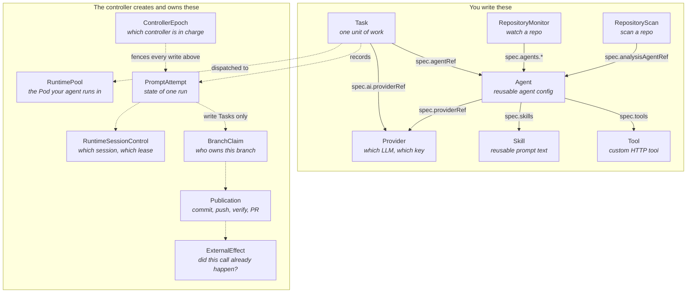
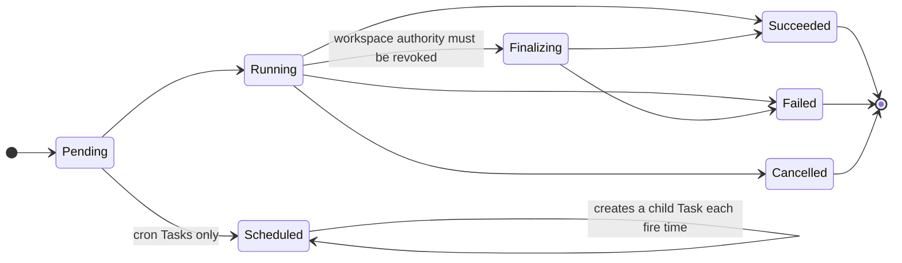
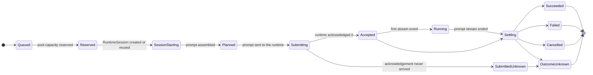

# Architecture

Orka is a Kubernetes-native task execution platform. Container and native AI Tasks run through worker Jobs; built-in coding-agent Tasks run through the ACP v2 RuntimePool and RuntimeSession control plane.

## Overview

```text
                               Orka Controller
  ┌──────────────────────────────────────────────────────────────────────┐
  │ Task/API/controllers   ACP dispatcher   RuntimePool controller       │
  │ Kubernetes control CRDs + Leases   SQLite payload/outbox/artifacts   │
  │ prompt MCP broker   artifact/credential brokers   publisher client   │
  └───────────────┬─────────────────────┬────────────────────────────────┘
                  │                     │
          native Task paths       type: agent (ACP v2)
             │                         │
      ┌──────┴──────┐          ┌───────┴────────┐        ┌──────────────┐
      │ General/AI  │          │ RuntimePool    │───────▶│ authenticated│
      │ worker Jobs │          │ 0 or 1 Pod     │        │ provider     │
      └─────────────┘          │ many private   │        │ proxy → Vekil│
                               │ RuntimeSessions│        └──────────────┘
                               └───────┬────────┘
                                       │ validated workspace delta
                               ┌───────┴────────────┐
                               │ Workspace/Publisher│
                               │ clone/prepare/CAS  │
                               │ push/verify/PR     │
                               └────────────────────┘
```

The ACP runtime and Workspace/Publisher use separate network and credential identities. Runtime Pods have only the authenticated provider-proxy and prompt-scoped MCP paths; they have no Git credentials or direct SCM publication egress. The Publisher obtains exact-operation artifact and credential capabilities from controller brokers. It has no provider/MCP access, and all HTTPS SCM and forge traffic traverses the authenticated exact-host SCM egress proxy.

## Core components

### Controller (`cmd/main.go`)

The controller is the central component that runs as a Kubernetes Deployment. It contains:

- **API Server**: Fiber-based REST and compatibility endpoints for:
  - task CRUD, results, logs, artifacts, plans, and children
  - sessions
  - memories and memory proposals
  - tools
  - agents
  - skills
  - repository security scanning
  - repository monitors
  - signed GitHub webhooks
  - chat
  - OpenAI-compatible API
  - Anthropic-compatible API
  - internal worker APIs
- **Task Reconciler**: Routes native Tasks to worker Jobs and built-in agent Tasks to the ACP dispatcher; there is no agent Job fallback
- **ACP Dispatcher**: Persists fenced attempts, reserves pool/session capacity, streams prompts, validates workspace deltas, and projects execution/delivery status
- **RuntimePool Controller**: Owns digest-pinned, scale-to-zero runtime Deployments, exact-Pod routing, admission, drain, replacement, and cleanup
- **Workspace/Publisher Client**: Invokes the separate clean-room clone, deterministic commit, exact-ref publication, verification, and PR-reconciliation service
- **ACP Control Store**: Uses Kubernetes CRD status and coordination Leases as the authority for controller epochs, attempts, RuntimeSessions, branch claims, publications, and external effects
- **Artifact/Credential Brokers**: Issue short-lived, exact-operation artifact access and release frozen role-specific Secret values only to the Workspace/Publisher
- **Prompt MCP Broker**: Revalidates Task, attempt, prompt lease, exact runtime fences, tool policy, approval evidence, and consequential-effect identity for every runtime tool call
- **RepositoryScanReconciler**: Watches `RepositoryScan` resources and drives repository security scanning:
  - schedules manual and cron scans
  - creates AI tasks for threat-model generation and vulnerability discovery
  - persists scan runs, threat models, findings, and patch proposals in SQLite
  - reads scan artifacts from the artifact store
  - auto-creates validation and patch proposal tasks when configured
  - updates status with phase, last scan, commits, and finding counts
- **RepositoryMonitorReconciler**: Watches `RepositoryMonitor` resources and drives durable PR review automation:
  - schedules manual and cron pull request inventory runs
  - queues exact-head runs from signed GitHub pull request webhooks
  - creates read-only reviewer Agent tasks for selected PR heads
  - persists monitor runs, PR items, review records, and audit events in SQLite
  - updates status with phase, last run, pending reviews, blocked items, and merge-ready counts
- **Session Manager**: Manages session persistence (via SQLite store) for conversation continuity with serial execution enforcement
- **Memory Store**: Persists durable memories, memory proposals, and transcript search data in SQLite for namespace-scoped agent context
- **Priority Queue**: Schedules tasks based on priority (0-1000)
- **Webhook Notifier**: Delivers completion notifications via HTTP callbacks
- **Embedded Web UI**: The React dashboard is compiled into the controller binary

### Custom Resource Definitions (`api/v1alpha1/`)

Current source packages 26 CRDs (v0.1.3 ships 17), but you
only ever write a handful of them by hand. The rest are
bookkeeping the controller creates and owns — they exist so that a controller restart, a crashed
Pod, or a lost network call cannot lose track of work in flight.



Solid arrows are references you type. Dotted arrows are relationships the controller maintains —
you can read them with `kubectl get`, but you never create or edit those objects yourself.

### The CRDs you write

| CRD | Purpose |
|-----|---------|
| **Task** | Core work unit — container, AI, or agent type |
| **Agent** | Reusable agent configurations with model, tools, skills, and optional runtime |
| **Provider** | LLM provider configuration (Anthropic, OpenAI, Azure OpenAI) |
| **Skill** | Reusable prompt content injected into agent system prompts |
| **Tool** | Custom HTTP-based tool definitions for agents |
| **RepositoryScan** | Repository security scan configuration, scheduling, status, and finding counts |
| **RepositoryMonitor** | GitHub pull request monitor configuration, scheduling, status, and queue counts |
| **OutboundAccessPolicy** | Which external hosts a Task may reach, and under what credentials. See [Outbound access](outbound-access.md) |
| **AgentRuntime** | Namespace-local v2 registration and conformance record for operator-owned external runtimes |
| **SubstrateActorPool** | Operator-owned desired state for a pool of Agent Substrate actors |

### The CRDs the controller owns

Read them when you are debugging. Do not edit them.

| CRD | Purpose |
|-----|---------|
| **RuntimePool** | Controller-owned logical pool for one trust domain and immutable built-in ACP profile |
| **ControllerEpoch** | Current controller holder/epoch and takeover fence |
| **PromptAttempt** | Durable ACP execution/delivery state for one Task attempt |
| **RuntimeSessionControl** | Logical Session lifecycle, exact runtime identity, and mutation lease state |
| **BranchClaim** | Compare-and-swap ownership/baseline for one publication branch |
| **Publication** | Prepared commit, push, verification, and optional PR reconciliation state |
| **ExternalEffect** | Idempotency and reconciliation ledger for consequential brokered calls |

### Gateway and workspace CRDs

These live in their own API groups.

The source Helm chart (`manifest_staging/charts/orka`) and Kustomize CRD bundle
(`config/crd`) both contain all 26 CRDs. With Kustomize, install the shared CRDs through
the cluster's designated CRD owner before deploying workloads. `config/acp-production`
excludes CRDs, and `make deploy` checks that the required shared CRDs are already established.

The v0.1.3 release manifest has 17 CRDs, including all four `workspace.orka.ai` kinds,
but lacks `RuntimeProviderConfig`, `RuntimeWorkspaceProfile`, and the current ACP execution
path. The 12-CRD inventory belongs
to the stale v0.1.1 `charts/orka/` snapshot. See [Release status](../reference/release-status.md)
for the install differences; installing newer CRDs alone does not add the corresponding
controller behavior.

They also differ in whether anything reconciles them once installed. Gateway reconciliation
is **on by default** (`--gateway-enabled` defaults to true). The workspace groups are **off
by default**; until they are enabled the CRDs exist and accept objects that nothing acts on.
The class-based workspace path requires these gates:

- `--enable-workspace-provider-api` — serves the workspace provider API
- `--task-provenance-admission-enabled` — protects reserved Task metadata
- `--workspace-class-use-admission-enabled` — authorizes workspace class use
- `--acp-workspace-dispatch-enabled` — lets Tasks actually dispatch onto a workspace
- the provider flag — `--agent-sandbox-enabled` or `--substrate-enabled`

The controller refuses to start with the provider API enabled unless both admission gates
are enabled. They require working TLS-backed webhooks with a serving certificate and
trusted CA bundle. For Kustomize, install `config/orka-admission` and meet its readiness,
trusted-identity, and AdmissionReview smoke-test prerequisites before applying
`config/orka-admission-webhooks`. See the [admission installation requirements](../reference/configuration.md#who-is-allowed-to-use-a-class).
Without the dispatch gate, Tasks that reference a class are still rejected.

| CRD | Group | Purpose |
|-----|-------|---------|
| **Gateway**, **GatewayClass**, **GatewayBinding** | `gateway.orka.ai` | Accept work from an external system through an adapter. See [Gateways](../operations/gateways.md) |
| **ExecutionWorkspace**, **ExecutionWorkspaceClass**, **ExecutionWorkspacePool**, **ExecutionWorkspaceProvider** | `workspace.orka.ai` | The class-based lifecycle for running an agent inside an external sandbox. See [Configuration](../reference/configuration.md#workspace-providers) |
| **RuntimeProviderConfig**, **RuntimeWorkspaceProfile** | `acp.workspace.orka.ai` | Provider settings and per-workspace profile parameters referenced by an `ExecutionWorkspaceClass` |

### Execution images

| Image | Description |
| --- | --- |
| **General Worker** (`workers/general/`) | Runs arbitrary container commands in a per-Task Job. |
| **AI Worker** (`workers/ai/`) | Runs native LLM/coordination Tasks in a per-Task Job. |
| **ACP Runtime** (`cmd/orka-acp-runtime`, `workers/acp/`) | Hosts multiple private Codex, Claude, Copilot, or OpenCode RuntimeSessions through `orka.harness.v2`; its per-session loopback proxy enforces provider routes and model selection. |
| **Provider Auth Proxy** (`cmd/orka-provider-auth-proxy`) | Authenticates traffic using the shared proxy credential and forwards it to Vekil. |
| **Workspace Publisher** (`cmd/orka-workspace-publisher`, `workers/publisher/`) | Uses a separate identity for clean-room clone, commit preparation, exact-ref publication, independent verification, and PR reconciliation. |

## Design decisions

| Area | Decision | Rationale |
|------|----------|-----------|
| **Result Storage** | SQLite (embedded) | No size limit, zero external dependencies, pure Go via `modernc.org/sqlite`. |
| **Session Storage** | SQLite (embedded) | Normalized schema with efficient querying and pagination. No size limit. |
| **Plan Storage** | SQLite (embedded) | Persists autonomous coordination plan state across iterations. |
| **Memory Storage** | SQLite (embedded) | Persists durable memories and reviewable memory proposals for namespace-scoped recall. |
| **Artifact Storage** | SQLite stores artifact metadata and BLOB content, 10MB max per artifact. | Keeps worker outputs co-located with task/session state while bounding per-artifact size. |
| **ACP Control Authority** | Kubernetes CRD status + coordination Leases | `resourceVersion` CAS and Leases provide shared/watchable epoch, attempt, Session, branch, publication, and external-effect fencing. |
| **ACP Payload/Outbox Storage** | SQLite behind Kubernetes fences | Stores transcript/SessionTurn payloads and deferred outbox projections without becoming a second control authority. |
| **Security Scan Storage** | SQLite stores repository scan runs, threat models, findings, and patch proposals. | Provides durable repository-security history without an external database. |
| **API Authentication** | Kubernetes ServiceAccount tokens plus optional OIDC JWT and generic context-token validation. | Native K8s auth by default; OIDC and `transaction-token` TxTokens support external/request-scoped API clients. |
| **Task Queue** | Priority queuing (0-1000) | Higher priority tasks are scheduled first. |
| **Secret Management** | Reference Kubernetes Secrets by role | Native workers receive only required Secrets. ACP source-read, target-read, target-write, forge, provider-proxy, publisher-auth, and capability roles stay separate; Git/forge values are brokered only to the clean-room Publisher. |
| **Observability** | Prometheus metrics, structured logs, optional OpenTelemetry traces and GenAI OTLP metrics. | Standard K8s metrics/logging with opt-in distributed tracing and model/tool latency telemetry. |
| **AI Tools** | Built-in + extensible via CRDs | Ship with categorized built-in tools and can be extended via Tool CRDs. |
| **Failure Policy** | Configurable retry with backoff | `spec.retryPolicy` with max retries and exponential backoff. |
| **Session Execution** | Serial per session | Tasks sharing a session run one-at-a-time to prevent race conditions. |
| **Worker Security** | Hardened pods | Non-root, read-only rootfs, all capabilities dropped, seccomp RuntimeDefault. |

## Project structure

```
orka/
├── api/v1alpha1/           # Type definitions for the nine Orka CRDs
├── cmd/
│   ├── main.go                # Controller entrypoint
│   ├── cli/                   # CLI tool (login, chat, agent, task, status)
│   └── migrate/               # Database migration (ConfigMaps → SQLite)
├── internal/
│   ├── api/                # REST API server, handlers, auth, chat, compatibility APIs
│   ├── controller/         # Reconcilers, job builder, session manager, priority queue
│   ├── llm/                # LLM provider interface and implementations
│   │   ├── anthropic/      # Anthropic Claude provider
│   │   └── openai/         # OpenAI provider
│   ├── store/              # Storage interfaces plus Kubernetes/SQLite adapters
│   │   ├── kube/           # Kubernetes-authoritative ACP control store
│   │   └── sqlite/         # Payload, outbox, sessions, plans, artifacts, memory, security
│   ├── tools/              # Built-in tool implementations
│   ├── metrics/            # Prometheus metrics
│   ├── worker/             # Tool executor for custom Tool CRDs
│   ├── cli/                # CLI command implementations
│   └── uiembed/            # Go embed for UI static assets
├── workers/
│   ├── ai/                 # Native AI worker (LLM agent with tools)
│   ├── general/            # General worker (container commands)
│   ├── acp/                # ACP supervisor and immutable runtime images
│   └── publisher/          # Clean-room workspace/publication image
├── ui/                     # React SPA (Vite + TanStack Router + shadcn/ui)
├── config/                 # Kustomize manifests (CRDs, RBAC, samples)
├── charts/orka/          # Helm chart
├── website/docs/           # Documentation
├── examples/               # Example workflows
└── test/                   # E2E tests
```

## Task lifecycle

There are two lifecycles, and they are not the same thing.

The first is the **Task phase** — what `kubectl get task` prints, and what the UI shows. Every
Task has one, whatever its type:



Native and container Tasks without an execution workspace can complete directly from
`Running` to `Succeeded` or `Failed`. `Finalizing` is used when execution-workspace
authority still needs revocation.

The second is the **attempt state** — the fine-grained record of one agent run. Native `ai` and
container Tasks do not have one; they use the worker Job lifecycle instead. Built-in
`type: agent` Tasks record every step in a `PromptAttempt`:



Two details the diagram compresses:

- Every state before `Accepted` can also jump straight to `Failed` or `Cancelled`. The arrows are
  left out so the happy path stays readable.
- `SubmittedUnknown` means Orka sent the prompt and never learned whether the runtime got it. It
  can only become `OutcomeUnknown` — never `Succeeded` and never a retry. Orka would rather leave
  you with an honest "I don't know" than run your prompt twice.

The selected RuntimePool scales from `Stopped` through `Starting` to `Serving/Accepting`. The dispatcher creates or reuses a private RuntimeSession, starts one non-reconnectable prompt stream, renews its lease, and records bounded events. A prompt that may have been accepted is never automatically replayed.

After prompt settlement, the RuntimeSession enters validation. Read Tasks succeed only after the final tree matches the verified baseline. Write Tasks with changes proceed through clean-room preparation, exact-ref publication, independent verification, optional PR reconciliation, and finalization. The controller settles the Kubernetes control records and SQLite transcript/outbox payloads before projecting terminal Task status.

The top-level Task phase, `status.execution`, and `status.delivery` are safe compatibility/read-model projections. The authoritative ACP transitions live in `PromptAttempt`, `RuntimeSessionControl`, `BranchClaim`, `Publication`, `ExternalEffect`, `RuntimePool.status`, and the associated coordination Leases.

## Multi-agent coordination

Coordinator agents can delegate subtasks to specialist agents at runtime. The LLM uses `delegate_task` and `wait_for_tasks` tools to create child Tasks and collect results. GitHub PR tools (`create_pull_request`, `check_pull_request_ci`, `review_pull_request`, `post_review_comment`, `merge_pull_request`, `auto_merge_pull_request`) enable end-to-end code review workflows. The controller enforces guardrails:

```
Coordinator Agent (depth 0)
├── delegate_task(agent: "specialist-a", prompt: "...")  → Child Task (depth 1)
├── delegate_task(agent: "specialist-b", prompt: "...")  → Child Task (depth 1)
│   └── delegate_task(agent: "sub-specialist", ...)      → Grandchild Task (depth 2)
└── wait_for_tasks(tasks: [...])  → aggregated results
```

**Controller enforcement** (in `handlePending`):
- **maxDepth**: Rejects child tasks exceeding the coordinator's depth limit
- **allowedAgents**: Rejects delegation to agents not in the coordinator's allow list
- **maxConcurrentChildren**: Requeues (not fails) child tasks when the active sibling count is at the limit

**ChildTaskStatus tracking** (in `handleRunning`): Coordinator tasks get `status.childTasks[]` populated with each child's name, agent, phase, and truncated result.

Child tasks use owner references for cascade deletion and labels (`orka.ai/parent-task`, `orka.ai/delegated-agent`) for querying.

See [Multi-agent coordination](../reference/multi-agent-coordination.md) for the tool schemas and the exact controller checks.

### Autonomous mode

When an agent's coordination config has `autonomous: true`, the controller runs the coordinator in a loop instead of completing the task after a single Job. Each iteration:

1. The coordinator Job runs, delegates sub-tasks, and updates the plan via the `update_plan` tool
2. The controller saves plan state to `PlanStore` (SQLite) and checks termination conditions
3. If not complete, a new Job is created for the next iteration with the accumulated plan state

Termination occurs when the LLM signals goal completion, max iterations are reached, or the task is suspended.

## Repository security scanning

`RepositoryScan` resources define repository URLs, branches, scan cadence, agents, validation policy, and patch-generation policy. The `RepositoryScanReconciler` starts with a threat-model task, then fans out discovery tasks across security scopes after the threat model succeeds. It ingests task artifacts from the artifact store, upserts threat models and findings into SQLite, updates scan-run status, and can automatically start validation or patch-proposal tasks based on scan policy.

RepositoryScan status reports the current phase, last scan ID/task, last successful scan time, processed commits, and finding counts so API clients and the UI can display repository security posture without querying all findings.

## Repository monitors

`RepositoryMonitor` resources define a GitHub repository, base branch, review agent, schedule, and safety labels for durable PR review automation. The `RepositoryMonitorReconciler` lists open pull requests, skips drafts or policy-blocked PRs, queues read-only reviewer Agent tasks for selected exact heads, ingests structured review results from completed tasks, and stores run/item/review/event history in SQLite.

Signed GitHub pull request webhooks can also enqueue exact-head monitor runs when `spec.review.exactEventEnabled` is true. Manual or webhook runs that target one PR refetch only that PR and leave unrelated inventory items untouched, while full inventory runs can retire PRs that are no longer open or in scope. RepositoryMonitor status reports the current phase, last run, open PR count, pending reviews, blocked items, and merge-ready counts; detailed run and queue state is served through the monitor API and dashboard.

## LLM provider architecture

The AI worker uses a pluggable provider interface:

```go
type Provider interface {
    Complete(ctx context.Context, req *CompletionRequest) (*CompletionResponse, error)
    Stream(ctx context.Context, req *CompletionRequest) (<-chan StreamChunk, error)
    Name() string
}
```

Implementations exist for Anthropic Claude and OpenAI. Provider selection is configured via the Provider CRD, which stores credentials in Kubernetes Secrets.

## Skills and Tools

Orka supports extensible AI capabilities through a three-layer system:

```
┌─────────────────────────────────────────────────────────────────┐
│  Layer 1: Skills (Skill CRDs)                                   │
│  - Agent Skills standard content (`spec.content.inline`)        │
│  - Mounted at /workspace/.skills and injected into prompts      │
├─────────────────────────────────────────────────────────────────┤
│  Layer 2: Built-in Tools (in worker image)                      │
│  - Core, coordination, GitHub, agent management, planning,      │
│    memory, transcript, chat, session, and task management       │
│  - Fast, no extra infrastructure                                │
├─────────────────────────────────────────────────────────────────┤
│  Layer 3: Custom Tools (Tool CRD + HTTP)                        │
│  - Point at internal services                                   │
│  - Namespace-scoped, RBAC-controlled                            │
│  - Header-based or body-based auth injection                    │
└─────────────────────────────────────────────────────────────────┘
```

Built-in tool categories:

- **Core**: `web_search`, `code_exec`, `file_read`, `web_fetch`, `file_write`, `request_approval`
  (the compatibility endpoints proxy the first five; `request_approval` is worker-only)
- **Coordination/task**: `delegate_task`, `wait_for_tasks`, `create_container_task`, `cancel_task`, `send_message`, `check_messages`
- **GitHub**: `create_pull_request`, `create_pr_monitor`, `list_pull_requests`, `check_pr_review_marker`, `check_pull_request_ci`, `merge_pull_request`, `auto_merge_pull_request`, `review_pull_request`, `post_review_comment`, `list_issues`, `get_issue`, `comment_on_issue`
- **Agent management**: `create_agent`, `delete_agent`, plus chat-management `update_agent`, `list_agents`
- **Planning/memory/transcript**: `update_plan`, `recall_memory`, `remember`, `propose_memory`, `search_transcript`
- **Chat/session/task management**: `create_ai_task`, `create_agent_task`, `check_task_progress`, `fetch_task_output`, `wait_for_task`, `list_tools`, `list_tasks`, `create_tool`, `delete_tool`, `delete_session`

## Session management

Sessions provide conversation continuity across multiple Tasks. Each session is stored in SQLite with a normalized schema (session metadata + individual messages).

Key behaviors:
- **Serial execution**: Tasks sharing a session execute one-at-a-time via a lock mechanism
- **Token tracking**: Input/output token counts tracked in the session record
- **Cross-runtime**: Sessions store user/assistant messages only, enabling cross-runtime continuation (AI ↔ agent tasks)
- **No size limit**: SQLite storage removes the old ConfigMap 1MB constraint
- **Runtime-specific delivery**: native workers fetch session context through their worker path; ACP RuntimeSessions are reconstructed from the canonical transcript and verified workspace baseline

## Memory model

Durable memory is stored in SQLite and scoped by namespace. AI workers load a bounded set of reviewed durable memories through the controller internal API and append them to the system prompt as background context. Memory context is best-effort: task execution should continue even if memory recall is unavailable.

Workers can also use memory tools for active recall and proposal creation:

- `recall_memory` queries durable memories by text, tags, task, agent, source, and limit.
- `search_transcript` searches prior session transcripts and returns compact snippets.
- `remember` creates a durable-memory proposal for review.
- `propose_memory` creates a memory-adjacent governance proposal.

Proposal review is intentionally separate from durable memory mutation. Accepting or rejecting a proposal records governance state but does not automatically create durable memory. See [memory.md](memory.md) for API examples and validation details.

## Security model

- **Native worker Pods**: Non-root, read-only rootfs, all capabilities dropped, seccomp RuntimeDefault
- **ACP runtime Pods**: Read-only rootfs, no service-account token, default-deny egress, narrowly scoped supervisor capabilities, and distinct non-reused child UIDs/GIDs per RuntimeSession
- **Workspace/Publisher**: Separate network/credential identity with operation-scoped SCM credentials and only authenticated proxy-mediated SCM/forge egress; no provider or prompt-broker access
- **Controller**: Non-root (uid 65532), read-only rootfs, seccomp RuntimeDefault
- **ServiceAccount TokenReview**: Default API authentication validates Kubernetes ServiceAccount bearer tokens via the TokenReview API.
- **Optional OIDC JWT validation**: External API endpoints can validate OIDC JWTs when issuer/audience settings are configured.
- **Optional context-token validation**: External API endpoints can validate generic context tokens, with built-in `transaction-token` TxToken support via `Txn-Token` and profile-specific issuer/audience/JWKS settings. Orka can enforce operation scopes and signed `tctx` constraints, stamp immutable transaction metadata, and use transaction-token TTS to narrow child/outbound tokens for delegated agents and downstream Tool calls.
- **Internal worker endpoints**: `/internal/v1` endpoints require ServiceAccount authentication for worker result, plan, message, artifact, memory, and transcript calls.
- **Secrets**: Provider-proxy, source-read, publication-read, publication-write, forge, artifact, publisher-auth, and prompt-broker roles are separate. Task status stores only safe references/versions and non-secret receipts; ACP children never receive Git or forge credentials.
- **`--watch-namespace`**: Optionally scopes the controller and API to a single namespace.
- **Namespace isolation**: `--enforce-namespace-isolation` restricts users to their ServiceAccount namespace.
- **Cross-namespace references**: Cross-namespace Agent and Provider references are rejected when namespace isolation is enforced.
- **Chat endpoint**: Blocks operations in `kube-system` and `kube-public` namespaces.

## Dependencies

| Package | Purpose |
|---------|---------|
| `sigs.k8s.io/controller-runtime` | Controller framework |
| `k8s.io/client-go` | Kubernetes client |
| `github.com/gofiber/fiber/v3` | HTTP router |
| `github.com/anthropics/anthropic-sdk-go` | Anthropic Claude API |
| `github.com/openai/openai-go/v3` | OpenAI API (official SDK) |
| `github.com/github/copilot-sdk/go` | GitHub Copilot integration used by the built-in Copilot ACP RuntimePool profile |
| `modernc.org/sqlite` | Embedded SQLite (pure Go, no CGO) |

## SQLite store internals

SQLite via `modernc.org/sqlite` (pure Go, no CGO dependency) stores Orka
payload/read-model data. ACP control authority is deliberately excluded:
controller epochs and Session mutation ownership use Kubernetes Leases, while
attempt, Session, branch, publication, and external-effect transitions use CRD
status `resourceVersion` CAS.

### Schema

| Table | Primary Key | Purpose |
|-------|-------------|---------|
| `results` | `(namespace, task_name)` | Task output data (BLOB) |
| `sessions` | `(namespace, name)` | Session metadata, `active_task` field for locking, token counters |
| `session_messages` | `id` (FK → sessions) | Individual messages with role, content, tool_calls (JSON) |
| `messages` | `id` + `namespace` + `parent_task` | Inter-agent messages, broadcast via `to_task='*'` |
| `plan_states` | `(namespace, task_name)` | Autonomous loop state: iteration, progress %, goal_complete flag |
| `memories` | `id` | Durable namespace-scoped memories with provenance, tags, disabled/deleted flags, and recall counters |
| `memory_proposals` | `id` | Reviewable memory/skill/policy/workflow proposals with status, reviewer, and review notes |
| `artifacts` | `(namespace, task_name, filename)` | Artifact metadata and BLOB content, 10MB max per artifact |
| `session_turns` / outbox tables | stable IDs | ACP transcript/SessionTurn payloads and deferred terminal projections committed behind Kubernetes epoch/Session fences |
| `security_scan_runs` | `id` | Repository scan run lifecycle, mode, commits, timestamps, summary, and errors |
| `security_threat_models` | `(namespace, repository_scan, version)` | Versioned repository threat models generated or edited for scans |
| `security_findings` | `id` | Deduplicated findings with severity, confidence, validation, evidence, and PR linkage |
| `security_patch_proposals` | `id` | Patch proposal tasks, branches, artifacts, status, and PR linkage for findings |

### Configuration

- **WAL mode** with single-writer enforcement: `SetMaxOpenConns(1)`, `SetMaxIdleConns(1)`
- **Per-connection pragmas** (set on every new connection, not persistent):
  - `busy_timeout=5000` — wait up to 5s for locks
  - `synchronous=NORMAL` — balance between safety and performance
  - `foreign_keys=ON` — enforce referential integrity
- **Namespace scoping**: All queries filter by `namespace` — data isolation is enforced at the SQL level

### Session locking

Sessions use optimistic locking via an `active_task` column. `AcquireLock` atomically sets `active_task` only if it's currently empty. Tasks that fail to acquire the lock requeue every 5 seconds. The lock is released on task completion or deletion (via finalizer cleanup). There is no timeout — if the lock holder crashes, the lock persists until the task is deleted.

### Message broadcast scoping

Inter-agent broadcast messages (`to_task='*'`) are scoped by `parent_task`:

```sql
WHERE (to_task = ? OR (to_task = '*' AND parent_task = ?))
```

This ensures only sibling tasks (same parent coordinator) receive broadcasts. Senders don't receive their own broadcasts.

## LLM provider internals

### Retry strategy

LLM calls use exponential backoff with jitter:
- **Default**: 3 retries
- **Backoff**: `baseDelay × 2^attempt`, capped at 30s, with ±10% random jitter
- **Retryable status codes**: 429, 500, 502, 503, 529
- **Non-retryable**: 401, 403 (trigger fallback instead), context canceled/deadline exceeded (never retried)
- **Stream retry**: Peeks at the initial stream event to detect errors before consuming the stream

### Provider cooldown

Failed providers are temporarily cooled down to prevent repeated failures:
- **Cooldown formula**: `1min × 5^(errorCount-1)`, capped at 1 hour
- Rate-limited providers (429) are tracked and skipped in subsequent requests
- Cooldown is per-provider and resets on successful requests

### OpenAI API auto-detection

The OpenAI provider automatically detects which API to use:
1. Tries the **Responses API** first
2. If the endpoint returns 404/405 or a known unsupported-API error code, switches to **Chat Completions API**
3. The API mode is stored as an `atomic.Int32` for thread-safe switching
4. Once detected, the mode persists for the provider's lifetime

Copilot-compatible Responses API 403s are handled as a scoped fallback to Chat Completions. Generic 403s still surface as provider errors instead of being treated as unsupported API signals.

### Anthropic quirks

- The Anthropic SDK appends `v1/messages` to the base URL — strip trailing `/v1` from custom `baseURL` to avoid doubled paths
- System messages are converted to `tool_result` blocks, not user messages
- Tool input JSON parsing errors are silently ignored (`_ = json.Unmarshal`)

## Generic external gateway plane

The `gateway.orka.ai/v1alpha1` vertical slice separates four seams:

1. **Transport/adapter:** an out-of-tree `orka.gateway.v1` service normalizes provider traffic and owns provider credentials.
2. **Semantic routing/governance:** `GatewayBinding` matches normalized account, context, thread, and sender identity to one Agent. Unknown or ambiguous identity fails closed.
3. **Execution:** durable Session-ordered events create normal Agent Tasks. The bound Agent, not a transport resource, selects the execution runtime.
4. **Hosting/network:** a Gateway uses either an HTTPS endpoint or a TLS-authenticated selector-backed same-namespace Service. Ingress controllers, meshes, proxies, and external load balancers remain optional deployment choices.

The SQLite gateway inbox/outbox acknowledges inbound traffic independently from execution, deduplicates external event IDs, serializes work per Session, and delivers terminal results with stable idempotency IDs. Canonical conversation history remains in Orka Sessions; adapter and runtime transcripts are replaceable projections.

See [the Generic Gateway API](../reference/gateway-api.md) for the normative envelope, authentication, bounds, state machines, and retry behavior.
