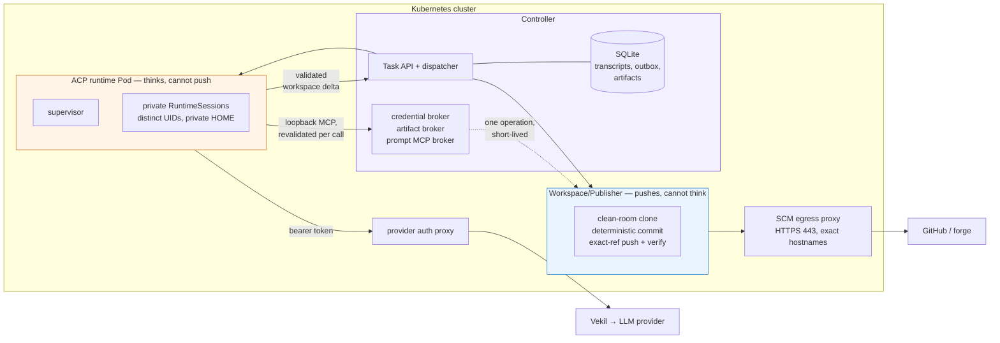

# Security

## The boundaries at a glance

On the ACP runtime and Workspace/Publisher path, the agent has no Git credentials and the
Publisher has no model credentials. The controller brokers credentials for specific operations.
The diagram below covers this path; native worker Pods have their own RBAC permissions.



What the picture is telling you:

| Component | Can reach | Cannot reach |
| --- | --- | --- |
| ACP runtime Pod | the provider auth proxy, and the controller's loopback MCP broker | the Kubernetes API, Git remotes, any other host — egress is default-deny |
| Workspace/Publisher | DNS, the controller API, the SCM egress proxy | LLM providers, the MCP broker, arbitrary internet hosts |
| Controller | everything above, plus the Kubernetes API | — it is the trusted core, so protect it accordingly |

The runtime Pod never holds a Git credential, and the Publisher never holds a model credential.
That is deliberate: a prompt injection that fully captures the agent still cannot push code, and
a compromised publisher still cannot exfiltrate through your model provider.

## Execution workloads

### Native worker Pods

Container and native `ai` Tasks run in per-Task worker Pods with a hardened security context:

- non-root user;
- read-only root filesystem;
- all Linux capabilities dropped;
- `RuntimeDefault` seccomp;
- optional `RuntimeClass`, node selector, tolerations, and affinity through `spec.execution`.

These workers use dedicated ServiceAccounts bound to `orka-ai-worker-role`,
`orka-vendor-worker-role`, or `orka-container-worker-role`. Include these identities when
auditing Kubernetes access.

### ACP RuntimePool Pods

Built-in `type: agent` Tasks run as private RuntimeSessions inside one controller-owned ACP RuntimePool Pod per trust domain/profile. The Pod:

- uses a digest-pinned immutable runtime image and profile digest;
- disables service-account token automount and has no Kubernetes RBAC;
- uses a read-only root filesystem and default-deny egress;
- runs the supervisor as root with only the documented process/identity capabilities;
- launches ACP children with no capabilities, private `HOME`/`TMPDIR`/XDG/workspace paths, and distinct non-reused UIDs/GIDs;
- tracks, terminates, and reaps the full process tree; cleanup uncertainty poisons and recycles the pool;
- carries no Git read or publication credential and has no direct SCM publication egress.

A shared pool is a same-administrative-trust-domain density boundary, not a hard tenant sandbox. Users who can mutate or exec into the runtime Pod, namespace administrators, node administrators, and sibling sessions in the same pool are trusted relative to that boundary.

Per-Task `spec.execution` container settings and custom resource requests are not honoured on
the ACP path: runtime isolation and resources come from the reviewed RuntimePool profile, not
from the Task. `spec.execution.workspace` is the one exception — it moves the agent into an
external sandbox provider, and only when the operator has enabled it
(`--acp-workspace-dispatch-enabled` plus `--agent-sandbox-enabled` or `--substrate-enabled`).
Everything else in `spec.execution` fails closed.

### Workspace/Publisher

The separate Workspace/Publisher identity has no provider-session or
prompt-broker access. The controller credential broker releases frozen
source-read, target-read, target-write, or forge values only for the exact
active operation. The artifact broker issues short-lived capabilities bound to
method, path, identity, operation, digest, size, media type, and expiry. The
Publisher holds neither the artifact signing key nor a global Git credential.

It creates sanitized source artifacts, prepares deterministic commits from
validated deltas, performs exact-ref publication, independently verifies the
remote, and optionally reconciles a PR.

The Publisher cannot open arbitrary public connections. Kubernetes egress permits only DNS, the controller API, and the authenticated SCM egress proxy. That proxy accepts only exact lower-case SCM/forge hostnames, permits only HTTPS/CONNECT on port 443, re-resolves and validates every outbound connection, and rejects private, loopback, link-local, metadata, reserved, and mixed public/private DNS answers. Redirects are disabled in both the Git/forge clients and the proxy's terminating forward mode; an encrypted CONNECT redirect to a different host still requires a new allowlisted proxy connection.

Command-based Publisher startup is production-safe by default: artifact authorization and credential material must come from the controller brokers, and the validated SCM proxy must be enabled. Local artifact-HMAC signing, filesystem credential roots, and proxy-less startup are accepted only when `ORKA_PUBLISHER_ALLOW_DEVELOPMENT_FALLBACKS=true` is set explicitly. Supported Helm and Kustomize manifests never set that development escape hatch.

The runtime child's `.git` directory, remotes, hooks, filters, refs, and history are untrusted for publication.

### Provider and prompt brokers

Built-in RuntimePools reach Vekil through the central authenticated provider proxy.
The supervisor's per-session loopback proxy validates provider routes and the model
against the immutable session profile. The central proxy checks the shared current or
previous bearer credential and forwards requests to Vekil. `config/acp-production`
applies the cross-namespace Vekil ingress policy required to prevent direct runtime access.

Every RuntimeSession also exposes a credential-protected loopback MCP proxy.
The controller broker revalidates Task, attempt, prompt, lease generation and
expiry, exact runtime fences, the canonical tool allowlist, and approval
evidence for every call. Settlement, cancellation, expiry, poisoning, and
deletion revoke authorization and cancel in-flight broker calls. Consequential
operations reserve a durable `ExternalEffect` identity before execution.

### Current ACP constraints

- External `AgentRuntime` v2 registration and conformance are supported, but `runtimeRef` Task dispatch remains fail-closed until the external v2 dispatcher support boundary is enabled.
- Non-empty write delivery uses the clean-room publisher and is successful only with a terminal independently verified `status.delivery` receipt.
- Codex, Claude, Copilot, and OpenCode are supported built-in RuntimePool profiles.

## Controller

The controller runs with:

- Non-root user (uid 65532)
- Read-only root filesystem
- Seccomp profile: RuntimeDefault

## Authentication

- All API endpoints require authentication with a Kubernetes ServiceAccount bearer token or, when configured, an OIDC JWT or generic context token
- ServiceAccount token validation uses the Kubernetes TokenReview API
- OIDC token validation checks issuer, audience, time claims, and RS256 signatures using either the configured JWKS URL or issuer metadata discovery
- Context-token validation supports the built-in `transaction-token` profile. transaction tokens are RS256-signed JWTs with `typ: txntoken+jwt`, matching issuer and audience, valid time claims, a non-empty subject, and required `iat`, `txn`, `scope`, and `req_wl` claims
- transaction tokens are read from the raw `Txn-Token` header by default. `Authorization: Bearer` support is opt-in with `--context-token-headers=Txn-Token,Authorization:Bearer` (or `ORKA_CONTEXT_TOKEN_HEADERS`); when enabled, only bearer JWTs with `typ: txntoken+jwt` are handled as context tokens so normal OIDC and ServiceAccount bearer tokens can coexist
- Optional context-token authorization can run in `off`, `audit`, or `enforce` mode with `--context-token-authz-mode` (or `ORKA_CONTEXT_TOKEN_AUTHZ_MODE`). In enforce mode, each operation class (task create/read/list/delete, tool read/use, provider use, agent, memory, session, security-scan, repository-monitor, and skill read/write) requires its configured scope, and Orka additionally honors signed `tctx` constraints — for example namespace, task type, agent, workspace repo/branch/ref, and allowed tools on Task creation, and namespace, provider/allowedProviders, model/allowedModels, and allowedTools on chat/OpenAI/Anthropic model-provider calls. See the [default-scope table](transaction-tokens.md#default-scopes) for the full operation-to-scope mapping and the configurable `--context-token-*-scopes` flags
- Optional transaction-token TTS exchange configuration is available with `--context-token-tts-endpoint` / `ORKA_CONTEXT_TOKEN_TTS_ENDPOINT` plus token-source and TTL settings. Orka keeps this disabled unless an endpoint is configured and does not store exchanged raw TxTokens in Task resources
- Delegation tools can exchange a mounted subject token for a child-scope TxToken when `ORKA_CONTEXT_TOKEN_TTS_ENDPOINT`, `ORKA_CONTEXT_TOKEN_SUBJECT_TOKEN_FILE`, and `ORKA_CONTEXT_TOKEN_CHILD_SCOPE` are configured; the requested child scope must be a subset of the parent transaction scopes, and the child token is stored in an ephemeral Secret that is referenced by Task annotation, adopted by the child Task after creation, and mounted into the child worker as a token file
- Worker HTTP Tool CRD calls can propagate a TxToken from a mounted file using `ORKA_TRANSACTION_TOKEN_FILE`; when `ORKA_CONTEXT_TOKEN_TTS_ENDPOINT` and `ORKA_CONTEXT_TOKEN_SUBJECT_TOKEN_FILE` are configured, workers exchange the subject token for an operation-scoped outbound TxToken before calling the tool. Token values are read at request time and are not stored in Task spec/status; downstream services must still verify incoming TxTokens and enforce their own policy
- Workspace-backed agent Tasks run through controller-owned `acp-ws-*` RuntimePools; the controller never forwards mounted transaction/context-subject token files into the workspace, and raw TxTokens are still not written to Task spec/status/logs.
- See [Transaction Token integration](transaction-tokens.md) for deployment examples, scope vocabulary, transaction metadata, TTS exchange, admission hardening, metrics, and rollout guidance
- Provider-backed `Task.spec.execution.workspace` dispatch is fail-closed behind `--acp-workspace-dispatch-enabled` plus the selected provider flag. Agent Sandbox uses only controller-rendered templates; Substrate accepts only an operator-owned infrastructure `templateRef` and derives the credential-free runtime template. Both providers bind one dedicated RuntimeSession workspace, bootstrap the exact attested instance with one-time credentials, keep provider-native identifiers out of Task status, and delete the physical workspace only after authenticated drain. Raw transaction tokens are never staged into retained workspaces or provider child environments.
- OIDC- and context-token-authenticated Task creation stamps the verified identity into immutable `spec.requestedBy`; context-token-authenticated Task creation also stamps immutable `spec.transaction` metadata for audit correlation. Client-supplied `requestedBy` and `transaction` fields are rejected
- Task provenance admission rejects untrusted direct Kubernetes Task creates/updates that set or modify Orka-managed provenance fields, including `spec.requestedBy`, `spec.transaction`, and transaction metadata labels/annotations. Helm enables it automatically. The opt-in Kustomize webhook bundle already uses `failurePolicy: Fail`; apply it only after completing the readiness, TLS, CA injection, and trusted-identity checks in [Task provenance admission hardening](../reference/configuration.md#task-provenance-admission-hardening)
- The `orka` CLI extracts tokens from kubeconfig for browser-based login
- **Token caching**: Validated ServiceAccount tokens are cached for 60 seconds using SHA256 hashes to avoid repeated TokenReview API calls. Token revocation has up to 60s propagation delay. The cache is in-memory only — not persistent across pod restarts

## Secret management

- Provider-proxy, source-read, publication-read, publication-write, forge,
  prompt-broker, publisher-auth, artifact, and operation-capability roles are
  separate.
- `Task.spec.workspace.readCredentialRef`,
  `publicationReadCredentialRef`, `publicationCredentialRef`, and
  `forgeCredentialRef` store only same-namespace Secret references; the
  selected UID/resourceVersion is frozen at reservation and values never appear
  in Task status.
- Git credentials are resolved by the clean-room boundary and are never mounted into ACP runtime Pods.
- Known Orka-supplied secret values are redacted before logs, events, results, transcripts, and traces; raw prompt/repository content still requires RBAC, encryption, retention, and content-capture policy.

## Namespace scoping

- Every controller requires one non-empty `--watch-namespace` and one static
  `--controller-mode` (`harness-v1` or `harness-v2`)
- The watched namespace must carry the matching
  `orka.ai/controller-mode` label; missing or mismatched claims fail startup
- Same-cluster v1/v2 installations use distinct namespaces, ServiceAccounts,
  RBAC, Leases, stores, Services, Secrets, and execution data planes
- Chat endpoint blocks operations in `kube-system` and `kube-public` namespaces
- The embedded UI is served over the same port as the API (no separate attack surface)

## Multi-tenancy

Orka supports soft multi-tenancy using Kubernetes namespaces as tenant boundaries.

### Namespace isolation

Enable `--enforce-namespace-isolation` to restrict users to their ServiceAccount's namespace:

- API requests are rejected (403) if the target namespace differs from the caller's SA namespace
- Tasks cannot reference Agents or Providers in other namespaces (cross-namespace `agentRef.namespace` and `providerRef.namespace` are rejected)
- Workers cannot submit results to namespaces other than their own
- All access denials are logged with caller identity and IP address

### External OIDC callers

When OIDC API authentication is enabled, configure an explicit subject allowlist and namespace binding. For GitHub Actions, allow only the trusted repository, branch, environment, or workflow subjects that should call Orka; issuer and audience validation alone is not an authorization policy. Authorized OIDC callers are assigned `--oidc-namespace` (default `default`) so `--enforce-namespace-isolation=true` prevents them from selecting arbitrary tenant namespaces.

```
--oidc-issuer=https://token.actions.githubusercontent.com
--oidc-audience=orka-ci
--oidc-allowed-subjects=repo:my-org/my-repo:ref:refs/heads/main
--oidc-namespace=ci
--enforce-namespace-isolation=true
```

### Per-namespace Task limits

Use `--max-tasks-per-namespace` to cap the number of active (Pending/Running) tasks per namespace. Tasks exceeding the limit are requeued with backoff. Set to `0` (default) for unlimited.

### Recommended production configuration

For multi-tenant deployments, enable both isolation and limits:

```
--enforce-namespace-isolation=true
--max-tasks-per-namespace=50
--controller-mode=harness-v2
--watch-namespace=team-v2
```

### Data isolation

Most ACP control CRDs are namespace-scoped, and their status transitions use
Kubernetes `resourceVersion` compare-and-swap. Controller-epoch and Session
mutation Leases fence cross-controller writes. SQLite payload/read-model data
(including transcripts, deferred outbox projections, and artifacts)
is also keyed by namespace, and queries filter by namespace. The controller,
API server, Publisher, brokers, and workers enforce namespace and exact-identity
boundaries at their respective layers. CRD schemas remain cluster-scoped and
have one platform lifecycle owner; schema sharing does not grant either
controller access to the other installation's resources.

### Audit logging

Security-relevant events are logged at the API layer:

- Authentication failures (missing/invalid tokens)
- Namespace access denials (isolation violations, watch-namespace mismatches)
- Cross-namespace worker access attempts

## Generic gateway trust boundary

Generic gateways keep provider credentials and raw provider requests outside Orka. Adapters submit only the bounded `orka.gateway.v1` envelope. Orka stores normalized text, stable external identity, allowlisted string metadata, and safe correlation; it never stores the original provider request or authorization header.

Inbound and outbound traffic use separate Gateway-bound bearer Secrets. Secrets must explicitly opt in and bind to the Gateway name; outbound Secrets also bind to the exact resolved adapter endpoint. Direct and `serviceRef` endpoints require HTTPS. Direct endpoints are restricted to public unicast addresses on every dial, with local/private/link-local/reserved addresses, Kubernetes Service names, proxies, redirects, and DNS rebinding fail-closed. For `serviceRef`, the adapter certificate must be trusted by the controller and valid for the resolved Service DNS name, so changing a Service selector or Pod label cannot redirect bearer credentials to an unauthenticated workload.

Unknown contexts, unauthorized senders, capability mismatches, unsafe endpoints, missing references, and equal-priority binding conflicts fail closed. Denial and terminal error replies are generic and do not expose stack traces, endpoints, tokens, provider identifiers, or controller internals. Queue, payload, retry, expiry, and retention bounds limit replay and exhaustion risk.
