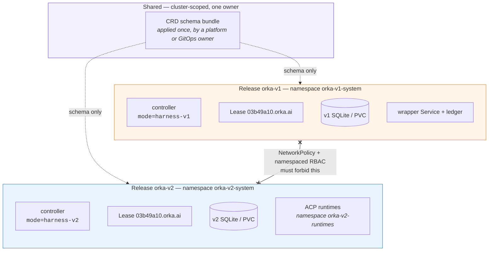

# Operating harness v1 and v2 on one cluster

Orka can run harness v1 and harness v2 on one Kubernetes cluster as two
independent installations. They share the Kubernetes API server and one
platform-owned CRD schema bundle, but they do not share Tasks, Sessions,
controller state, or execution data planes.

## Static mode contract

Each controller accepts exactly one required mode:

| Mode | Agent execution path |
| --- | --- |
| `harness-v1` | Legacy turn-oriented harness wrapper |
| `harness-v2` | ACP RuntimePools and RuntimeSessions |

There is no `dual`, `auto`, or `harness-v1-drain` mode. A release never changes
mode in place.

The controller also requires a non-empty watched namespace labeled with the
same mode:

```bash
kubectl create -f - <<'EOF'
apiVersion: v1
kind: Namespace
metadata:
  name: orka-v1-system
  labels:
    orka.ai/controller-mode: harness-v1
---
apiVersion: v1
kind: Namespace
metadata:
  name: orka-v2-system
  labels:
    orka.ai/controller-mode: harness-v2
EOF
```

:::warning[The label must exist before the controller starts]
A missing or mismatched `orka.ai/controller-mode` label fails startup. Set it when you create
the namespace. Do not adopt an unlabeled namespace, and do not relabel one to move it between
modes — the two harnesses own different resources in it.
:::

## Isolation checklist

The two installs share exactly two things: the Kubernetes API server, and one cluster-scoped CRD
bundle. Everything else is duplicated.



The leader-election ID is hardcoded to `03b49a10.orka.ai` in both installs, but each Lease lives in
its own watched namespace — so the two controllers never contend for the same lock, and never
coordinate over one Task population.

Use different values for every release-owned resource:

| Boundary | Harness v1 | Harness v2 |
| --- | --- | --- |
| Helm release | `orka-v1` | `orka-v2` |
| Release/watch namespace | `orka-v1-system` | `orka-v2-system` |
| Controller API | v1-specific Service/endpoint | v2-specific Service/endpoint |
| Leader election | Lease in `orka-v1-system` | Lease in `orka-v2-system` |
| State | v1-only SQLite/PVC/backups | v2-only SQLite/PVC/backups |
| Data plane | Wrapper Service and ledger | Dedicated ACP runtime namespace |
| Identity | v1 ServiceAccounts and Secrets | v2 ServiceAccounts and Secrets |

NetworkPolicies and namespace-scoped RBAC must prevent either controller from
reading or writing the other watched namespace. A namespace-scoped controller
cache is not an authorization boundary by itself.

The supported Helm topology co-locates each controller and its watched objects
in the release namespace. The chart rejects a different
`controller.watchNamespace`, which keeps all namespaced RBAC and release-owned
data-plane resources inside one boundary. Harness v2 still uses a separate
runtime namespace.

The v2 release owns cluster-scoped gateway and workspace-provider reconcilers.
Do not enable those reconcilers in v1. Install common cluster-scoped admission
resources once.

## Manage CRDs once

CRDs are cluster-scoped, so both installations use one schema bundle capable of
storing the supported v1 and v2 shapes. Designate a platform or GitOps owner,
apply the target CRDs before either controller upgrade, and install both Helm
releases with `--skip-crds`:

```bash
scripts/apply-helm-crds.sh /absolute/path/to/orka-chart.tgz my-context

helm install orka-v1 /absolute/path/to/orka-chart.tgz \
  --namespace orka-v1-system \
  --skip-crds \
  --set controller.mode=harness-v1 \
  --set controller.watchNamespace=orka-v1-system

helm install orka-v2 /absolute/path/to/orka-chart.tgz \
  --namespace orka-v2-system \
  --skip-crds \
  --set controller.mode=harness-v2 \
  --set controller.watchNamespace=orka-v2-system \
  --set controller.acpRuntime.namespace=orka-v2-runtimes
```

Add the required digest-pinned images, Secrets, proxy, Publisher, storage, and
wrapper values for each selected mode. Do not let both releases install or
upgrade the CRDs independently. Helm does not update `crds/` during
`helm upgrade`.

An existing release is eligible for an in-place controller upgrade only when
its namespace already carries the exact static mode claim and any live
controller declares that mode and watch namespace. A deleted controller may be
recreated only under that retained same-mode claim. A pre-static controller
that implicitly enabled ACP is not a supported static-v2 upgrade source:
accepted work may lack the immutable execution authority needed for safe
recovery. Settle or retire it, preserve its existing state, and install
`harness-v2` as a new release and namespace. The canonical Helm and
direct-Kustomize paths enforce this before changing workloads.

## Route new work explicitly

Producers choose an installation by its API endpoint and watched namespace.
During v2 rollout:

1. leave existing v1 Tasks and Sessions on the v1 endpoint;
2. install v2 in its fresh namespaces and run new v2 canaries;
3. verify cross-namespace API access is forbidden;
4. point selected producers at the v2 endpoint;
5. create new v2 Agents, Tasks, and Sessions.

Unavailable v2 capacity fails closed. It never sends work to the v1 wrapper.

## No protocol migration

Do not:

- patch a v1 Agent, AgentRuntime, or Task into v2;
- reuse a v1 controller PVC, database, wrapper ledger, or Session in v2;
- copy a transcript and claim continuation of the original Session;
- ask one controller to cancel, settle, publish, finalize, or clean up the
  other controller's work;
- change `controller.mode` or `orka.ai/controller-mode` on an existing
  installation.

You may copy non-secret configuration into a newly created object in the other
installation. It has a new namespace, UID, Session lineage, attempt history,
and external-effect history; it is not migrated work.

## Drain and retire v1

Draining v1 is an operational procedure, not a controller mode:

1. stop v1 API ingress and every internal or external v1 producer;
2. revoke permissions that create v1 agent Tasks;
3. record a cutoff and inventory queued, active, finalizing, and cleanup work;
4. let existing work settle through v1, preserving unknown outcomes where
   acceptance cannot be disproved;
5. repeat uncached inventory until v1 execution, Session settlement,
   finalizers, and wrapper-ledger cleanup reach zero;
6. back up retained v1 history and state;
7. remove v1 workloads and revoke their credentials;
8. delete PVCs or historical data only under a separate retention decision.

The wrapper's authenticated Pod-template drain remains required before a
wrapper upgrade. It protects in-memory v1 turns and is unrelated to controller
mode or v2.

## Rollback

Rollback changes only future routing. Stop new submissions to v2 and, if the
v1 installation is still intentionally open, submit replacement work there as
new v1 Tasks. Existing v2 work remains owned by v2 and must settle or be
canceled through v2.

Keep the shared CRD superset while either v1 or v2 objects remain. Restore each
installation only from its own coordinated Kubernetes and persistent-state
backup; never restore one mode's state into the other.

The full architecture and release gates are in the
[isolated coexistence plan](https://github.com/orka-agents/orka/blob/main/docs/harness-v1-v2-coexistence-plan.md).
